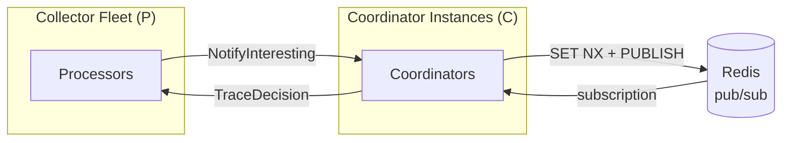

# Coordinator Performance

## Parameters

| Symbol | Meaning | Example value |
|--------|---------|---------------|
| P | Processors (total collector count) | 10,000 |
| I | Interesting traces per second (fleet-wide) | 10,000 |
| S | Services per trace (average collectors that see a given trace; each service would report a single trace to one collector) | 30 |
| C | Coordinator instances | 10 |
| M | Message size (bytes); proto-framed trace ID ≈ 20 B | 20 |

## Architecture



## Traffic formulas

### Processor → Coordinator (NotifyInteresting)

Only the collector that sees the interesting span sends a notification (one per trace):

```
fleet:            I × M
per coordinator:  I × M / C
```

Example (I=10k, M=20 B, C=10): 200 KB/s fleet → 20 KB/s per coordinator.

**Risk:** low. Scales linearly with I; adding coordinators reduces per-instance load proportionally. Even at 10× I the fleet total is 2 MB/s.

### Coordinator → Redis

One `SET NX` per trace, always succeeding (no contention since only one collector notifies):

```
Redis commands/s:  2 × I / C   (SET NX + PUBLISH per trace)
```

Example (I=10k, C=10): 2k commands/s per coordinator.

**Risk:** moderate. Commands/s scales with I and is offset by C. Redis can sustain ~100k simple commands/s on a single node; at 10× I without scaling C, per-coordinator load reaches 20k commands/s — still within range, but Redis becomes a concentration risk: it is a single write path and a failure point regardless of how many coordinator instances run.

### Redis → Coordinator (subscription)

Every coordinator instance subscribes to the same channel and receives every decision. Redis must push to each subscriber individually:

```
per coordinator:  I × M
total Redis out:  I × M × C
```

Example (I=10k, M=20 B, C=10): 200 KB/s per coordinator, 2 MB/s total Redis outbound.

**Risk:** moderate. Total Redis outbound scales with the product I × C — a 10× increase in either doubles the load on Redis's outbound network, and a 10× increase in both raises it 100×. At C=100 and I=100k the total reaches 200 MB/s from Redis, which approaches practical limits for a single Redis node.

### Coordinator → Processors (TraceDecision broadcast)

Every coordinator receives every decision from Redis and broadcasts to its connected processors. Each coordinator handles P/C processors:

```
sends/s per coordinator:   I × P/C
outbound per coordinator:  I × P/C × M
fleet total sends/s:       I × P          (= I × P/C × C)
fleet total outbound:      I × P × M
```

Adding coordinator instances reduces per-coordinator load linearly, but fleet total is fixed at I × P.

Example (I=10k, P=10k, M=20 B):

| C | Sends/s per coordinator | Outbound per coordinator |
|---|-------------------------|--------------------------|
| 1 | 100M | 2 GB/s |
| 10 | 10M | 200 MB/s |
| 100 | 1M | 20 MB/s |

**Risk:** high. Fleet total scales with I × P — a 10× increase in either variable raises total broadcast traffic 10×; a 10× increase in both raises it 100× (200 GB/s at I=100k, P=100k). Adding coordinators does not reduce fleet total, only per-instance load.

## Waste

The coordinator doesn't know which processors hold buffered spans for a given trace, so it broadcasts to all P/C connected processors. Only S/C of them (on average) have useful data:

```
efficiency per instance:  S / P
wasted sends fraction:    1 − (S / P)
```

Example (S=30, P=10k): efficiency = 0.3%; 99.7% of decision sends produce no action on the receiving processor.

If targeted broadcast were possible (send only to the S collectors that saw the trace):

```
fleet sends/s (targeted):   I × S × M
fleet sends/s (broadcast):  I × P × M
outbound reduction:         P / S
```

Example: 333× reduction — 6 MB/s fleet-wide instead of 2 GB/s.

However, targeted broadcast requires every collector to notify the coordinator of **all** trace IDs it sees, not just interesting ones — so the coordinator can maintain a traceID → collector mapping. Let `p` be the effective sampling rate. With p=5%, total trace rate is `I / p`, each seen by S collectors:

```
trace ID reports/s (fleet):  (I / p) × S
vs. current inbound:          I
increase factor:              S / p
```

Example (I=10k, S=30, p=0.05): 6M reports/s fleet-wide vs. 10k today — 600× more inbound traffic — and 95% of those reports are for traces that will never be sampled and whose mapping entries are never used. The coordinator would also need to maintain a live traceID → collector set, sized for the full trace window. The outbound savings (333×) do not outweigh the inbound cost and added coordinator complexity.
