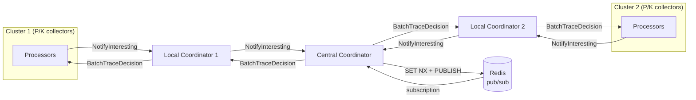

# Daisy-Chain Coordinators Implementation Plan

> **For agentic workers:** REQUIRED SUB-SKILL: Use superpowers:subagent-driven-development (recommended) or superpowers:executing-plans to implement this plan task-by-task. Steps use checkbox (`- [ ]`) syntax for tracking.

**Goal:** Add an `upstream` PubSub mode that lets a coordinator proxy notifies to a parent coordinator, enabling arbitrarily-deep chains that reduce cross-cluster broadcast traffic.

**Architecture:** A new `coordinator/upstream` package implements the `PubSub` interface by wrapping a gRPC coordinator client. When `Publish` is called, the traceID is forwarded to the upstream coordinator; when the upstream broadcasts a decision back, `Subscribe` handlers are called. No local deduplication — the upstream handles that. `main.go` wiring (`onNotify → ps.Publish`, `ps.Subscribe → srv.Broadcast`) is unchanged.

**Tech Stack:** `google.golang.org/grpc`, `pitr.ca/retroactivesampling/proto`, `github.com/stretchr/testify`

---

## File Map

| Action | Path | Responsibility |
|--------|------|----------------|
| Create | `coordinator/upstream/pubsub.go` | `upstream.PubSub` — gRPC client, reconnect loop, handler dispatch |
| Create | `coordinator/upstream/pubsub_test.go` | Unit tests for upstream.PubSub |
| Create | `coordinator/upstream/integration_test.go` | End-to-end test: two wired coordinators |
| Modify | `coordinator/config.go` | Add `UpstreamConfig`, extend `ModeConfig` |
| Modify | `coordinator/main.go` | Add `upstream` import and mode case |
| Modify | `PERFORMANCE.md` | Daisy-chain traffic analysis |
| Modify | `coordinator/README.md` | Document upstream mode and daisy-chain topology |

---

## Task 1: `upstream.PubSub` — tests then implementation

**Files:**
- Create: `coordinator/upstream/pubsub.go`
- Create: `coordinator/upstream/pubsub_test.go`

- [ ] **Step 1: Write the test file**

`coordinator/upstream/pubsub_test.go`:

```go
package upstream_test

import (
	"context"
	"encoding/hex"
	"net"
	"sync"
	"testing"
	"time"

	"github.com/stretchr/testify/assert"
	"github.com/stretchr/testify/require"
	"google.golang.org/grpc"
	"google.golang.org/grpc/credentials/insecure"

	gen "pitr.ca/retroactivesampling/proto"
	"pitr.ca/retroactivesampling/coordinator/upstream"
)

// mockServer implements gen.CoordinatorServer. notified receives traceID hex
// strings for each NotifyInteresting received. decisionCh items are sent as
// BatchTraceDecision to the connected client. connected is closed once.
type mockServer struct {
	gen.UnimplementedCoordinatorServer
	notified   chan string
	decisionCh chan []byte
	connected  chan struct{}
	once       sync.Once
}

func (m *mockServer) Connect(stream gen.Coordinator_ConnectServer) error {
	m.once.Do(func() { close(m.connected) })
	go func() {
		for {
			select {
			case tid, ok := <-m.decisionCh:
				if !ok {
					return
				}
				_ = stream.Send(&gen.CoordinatorMessage{
					Payload: &gen.CoordinatorMessage_Batch{
						Batch: &gen.BatchTraceDecision{TraceIds: [][]byte{tid}},
					},
				})
			case <-stream.Context().Done():
				return
			}
		}
	}()
	for {
		msg, err := stream.Recv()
		if err != nil {
			return err
		}
		if n := msg.GetNotify(); n != nil {
			m.notified <- hex.EncodeToString(n.TraceId)
		}
	}
}

func newMock() *mockServer {
	return &mockServer{
		notified:   make(chan string, 10),
		decisionCh: make(chan []byte, 10),
		connected:  make(chan struct{}),
	}
}

func startMockServer(t *testing.T, srv *mockServer) string {
	t.Helper()
	lis, err := net.Listen("tcp", "127.0.0.1:0")
	require.NoError(t, err)
	gs := grpc.NewServer()
	gen.RegisterCoordinatorServer(gs, srv)
	go func() { _ = gs.Serve(lis) }()
	t.Cleanup(gs.Stop)
	return lis.Addr().String()
}

const traceHex = "aabbccdd11223344aabbccdd11223344"

func TestPublishSendsNotifyInteresting(t *testing.T) {
	mock := newMock()
	addr := startMockServer(t, mock)

	ps := upstream.New(addr)
	t.Cleanup(func() { _ = ps.Close() })

	novel, err := ps.Publish(t.Context(), traceHex)
	require.NoError(t, err)
	assert.True(t, novel)

	select {
	case id := <-mock.notified:
		assert.Equal(t, traceHex, id)
	case <-time.After(3 * time.Second):
		t.Fatal("timeout: NotifyInteresting not received by upstream")
	}
}

func TestPublishAlwaysReturnsTrue(t *testing.T) {
	mock := newMock()
	addr := startMockServer(t, mock)

	ps := upstream.New(addr)
	t.Cleanup(func() { _ = ps.Close() })

	for range 3 {
		novel, err := ps.Publish(t.Context(), traceHex)
		require.NoError(t, err)
		assert.True(t, novel, "upstream.PubSub has no local dedup — must always return true")
	}
}

func TestSubscribeHandlerFiredOnDecision(t *testing.T) {
	mock := newMock()
	addr := startMockServer(t, mock)

	ps := upstream.New(addr)
	t.Cleanup(func() { _ = ps.Close() })

	received := make(chan string, 1)
	ctx, cancel := context.WithCancel(t.Context())
	defer cancel()
	// Subscribe before connection is established to guarantee handler is registered first.
	go func() { _ = ps.Subscribe(ctx, func(id string) { received <- id }) }()
	time.Sleep(50 * time.Millisecond) // let goroutine run and register handler

	// Wait for connection before sending decision.
	select {
	case <-mock.connected:
	case <-time.After(3 * time.Second):
		t.Fatal("upstream connection not established")
	}

	traceBytes, _ := hex.DecodeString(traceHex)
	mock.decisionCh <- traceBytes

	select {
	case id := <-received:
		assert.Equal(t, traceHex, id)
	case <-time.After(3 * time.Second):
		t.Fatal("timeout: Subscribe handler not called with decision")
	}
}

func TestCloseStopsReconnectLoop(t *testing.T) {
	// No server listening — PubSub will loop retrying. Close() must still return quickly.
	lis, err := net.Listen("tcp", "127.0.0.1:0")
	require.NoError(t, err)
	addr := lis.Addr().String()
	lis.Close() // immediately release so nothing is listening

	ps := upstream.New(addr)
	done := make(chan struct{})
	go func() { _ = ps.Close(); close(done) }()

	select {
	case <-done:
	case <-time.After(3 * time.Second):
		t.Fatal("Close() did not return in time")
	}
}
```

- [ ] **Step 2: Run tests — expect compilation failure (package doesn't exist yet)**

```bash
cd coordinator && go test ./upstream/... 2>&1 | head -20
```

Expected: `cannot find package` or `no Go files`

- [ ] **Step 3: Write the implementation**

`coordinator/upstream/pubsub.go`:

```go
package upstream

import (
	"context"
	"encoding/hex"
	"log"
	"sync"
	"time"

	"google.golang.org/grpc"
	"google.golang.org/grpc/credentials/insecure"

	gen "pitr.ca/retroactivesampling/proto"
)

const sendBufSize = 256

type PubSub struct {
	endpoint string
	sendCh   chan string
	mu       sync.RWMutex
	handlers []func(string)
	ctx      context.Context
	cancel   context.CancelFunc
	done     chan struct{}
}

func New(endpoint string) *PubSub {
	ctx, cancel := context.WithCancel(context.Background())
	p := &PubSub{
		endpoint: endpoint,
		sendCh:   make(chan string, sendBufSize),
		ctx:      ctx,
		cancel:   cancel,
		done:     make(chan struct{}),
	}
	go func() { defer close(p.done); p.run() }()
	return p
}

// Publish enqueues traceID to be forwarded upstream. Always returns (true, nil) — no local dedup.
func (p *PubSub) Publish(_ context.Context, traceID string) (bool, error) {
	select {
	case p.sendCh <- traceID:
	default: // best-effort: drop if buffer full during reconnect
	}
	return true, nil
}

// Subscribe registers handler and blocks until ctx is cancelled.
// Call before meaningful upstream decisions are expected to avoid a startup race.
func (p *PubSub) Subscribe(ctx context.Context, handler func(string)) error {
	p.mu.Lock()
	p.handlers = append(p.handlers, handler)
	p.mu.Unlock()
	<-ctx.Done()
	return nil
}

func (p *PubSub) Close() error {
	p.cancel()
	<-p.done
	return nil
}

func (p *PubSub) run() {
	backoff := time.Second
	for {
		select {
		case <-p.ctx.Done():
			return
		default:
		}
		if err := p.connect(); err != nil {
			log.Printf("upstream: connection lost, retrying in %s: %v", backoff, err)
			select {
			case <-p.ctx.Done():
				return
			case <-time.After(backoff):
				if backoff < 30*time.Second {
					backoff *= 2
				}
			}
		} else {
			backoff = time.Second
		}
	}
}

func (p *PubSub) connect() error {
	conn, err := grpc.NewClient(p.endpoint, grpc.WithTransportCredentials(insecure.NewCredentials()))
	if err != nil {
		return err
	}
	defer func() { _ = conn.Close() }()

	stream, err := gen.NewCoordinatorClient(conn).Connect(p.ctx)
	if err != nil {
		return err
	}

	recvErr := make(chan error, 1)
	go func() {
		for {
			msg, err := stream.Recv()
			if err != nil {
				recvErr <- err
				return
			}
			if b := msg.GetBatch(); b != nil {
				p.mu.RLock()
				hs := p.handlers
				p.mu.RUnlock()
				for _, raw := range b.TraceIds {
					tid := hex.EncodeToString(raw)
					for _, h := range hs {
						h(tid)
					}
				}
			}
		}
	}()

	for {
		select {
		case traceID := <-p.sendCh:
			tid, _ := hex.DecodeString(traceID)
			if err := stream.Send(&gen.ProcessorMessage{
				Payload: &gen.ProcessorMessage_Notify{
					Notify: &gen.NotifyInteresting{TraceId: tid},
				},
			}); err != nil {
				return err
			}
		case err := <-recvErr:
			return err
		case <-p.ctx.Done():
			return nil
		}
	}
}
```

- [ ] **Step 4: Run tests — expect all pass**

```bash
cd coordinator && go test ./upstream/... -v -run 'TestPublish|TestSubscribe|TestClose'
```

Expected: all 4 tests PASS

- [ ] **Step 5: Commit**

```bash
git add coordinator/upstream/pubsub.go coordinator/upstream/pubsub_test.go
git commit -m "feat(coordinator): add upstream PubSub mode for daisy-chain topology"
```

---

## Task 2: Config — add `UpstreamConfig`

**Files:**
- Modify: `coordinator/config.go`

- [ ] **Step 1: Add `UpstreamConfig` and extend `ModeConfig`**

In `coordinator/config.go`, make these changes:

```go
// Add after DistributedConfig struct:
type UpstreamConfig struct {
	Endpoint string `yaml:"endpoint"`
}
```

Extend `ModeConfig`:

```go
type ModeConfig struct {
	Single      *SingleConfig      `yaml:"single"`
	Distributed *DistributedConfig `yaml:"distributed"`
	Upstream    *UpstreamConfig    `yaml:"upstream"`
}
```

Extend `ModeConfig.active()` — add the upstream branch before the final check:

```go
func (m ModeConfig) active() (any, error) {
	var n int
	var result any
	if m.Single != nil {
		n++
		result = m.Single
	}
	if m.Distributed != nil {
		n++
		result = m.Distributed
	}
	if m.Upstream != nil {
		n++
		result = m.Upstream
	}
	if n != 1 {
		return nil, fmt.Errorf("exactly one mode must be configured (got %d)", n)
	}
	return result, nil
}
```

- [ ] **Step 2: Build check**

```bash
cd coordinator && go build ./...
```

Expected: no errors

- [ ] **Step 3: Commit**

```bash
git add coordinator/config.go
git commit -m "feat(coordinator): add upstream mode config"
```

---

## Task 3: Wire `upstream` mode into `main.go`

**Files:**
- Modify: `coordinator/main.go`

- [ ] **Step 1: Add import and new case**

Add `"pitr.ca/retroactivesampling/coordinator/upstream"` to the import block in `coordinator/main.go`.

The import block currently has:
```go
import (
    ...
    "pitr.ca/retroactivesampling/coordinator/memory"
    "pitr.ca/retroactivesampling/coordinator/redis"
    "pitr.ca/retroactivesampling/coordinator/server"
    gen "pitr.ca/retroactivesampling/proto"
)
```

Change it to:
```go
import (
    ...
    "pitr.ca/retroactivesampling/coordinator/memory"
    "pitr.ca/retroactivesampling/coordinator/redis"
    "pitr.ca/retroactivesampling/coordinator/server"
    "pitr.ca/retroactivesampling/coordinator/upstream"
    gen "pitr.ca/retroactivesampling/proto"
)
```

In the `switch m := activeMode.(type)` block (currently ends at `default: log.Fatalf(...)`), add a case before `default`:

```go
case *UpstreamConfig:
    if m.Endpoint == "" {
        log.Fatal("upstream mode: endpoint is required")
    }
    log.Printf("running in upstream mode, upstream: %s", m.Endpoint)
    ps = upstream.New(m.Endpoint)
```

- [ ] **Step 2: Build check**

```bash
cd coordinator && go build ./...
```

Expected: no errors

- [ ] **Step 3: Run all coordinator tests**

```bash
cd coordinator && go test ./...
```

Expected: all pass

- [ ] **Step 4: Commit**

```bash
git add coordinator/main.go
git commit -m "feat(coordinator): wire upstream PubSub mode into main"
```

---

## Task 4: Integration test — two coordinators wired end-to-end

**Files:**
- Create: `coordinator/upstream/integration_test.go`

This test runs two real coordinators (central=single-node, local=upstream) and a collector client, verifying the full notify→broadcast path.

- [ ] **Step 1: Write the integration test**

`coordinator/upstream/integration_test.go`:

```go
package upstream_test

import (
	"context"
	"encoding/hex"
	"net"
	"testing"
	"time"

	"github.com/stretchr/testify/assert"
	"github.com/stretchr/testify/require"
	"google.golang.org/grpc"
	"google.golang.org/grpc/credentials/insecure"

	"pitr.ca/retroactivesampling/coordinator/memory"
	"pitr.ca/retroactivesampling/coordinator/server"
	"pitr.ca/retroactivesampling/coordinator/upstream"
	gen "pitr.ca/retroactivesampling/proto"
)

func startCoordServer(t *testing.T, srv *server.Server) string {
	t.Helper()
	lis, err := net.Listen("tcp", "127.0.0.1:0")
	require.NoError(t, err)
	gs := grpc.NewServer()
	gen.RegisterCoordinatorServer(gs, srv)
	go func() { _ = gs.Serve(lis) }()
	t.Cleanup(gs.Stop)
	return lis.Addr().String()
}

func TestIntegrationLocalToCentral(t *testing.T) {
	// Central coordinator: single-node with memory PubSub.
	memPS := memory.New(time.Minute)
	centralSrv := server.New(func(traceID string) {
		_, _ = memPS.Publish(t.Context(), traceID)
	}, nil, nil, nil, nil)
	go func() {
		_ = memPS.Subscribe(t.Context(), func(id string) { centralSrv.Broadcast(id) })
	}()
	centralAddr := startCoordServer(t, centralSrv)

	// Local coordinator: upstream PubSub pointing at central.
	localPS := upstream.New(centralAddr)
	t.Cleanup(func() { _ = localPS.Close() })

	localSrv := server.New(func(traceID string) {
		_, _ = localPS.Publish(t.Context(), traceID)
	}, nil, nil, nil, nil)
	// Subscribe must be registered before any decisions can arrive from upstream.
	go func() {
		_ = localPS.Subscribe(t.Context(), func(id string) { localSrv.Broadcast(id) })
	}()
	time.Sleep(200 * time.Millisecond) // let upstream connection establish and handler register
	localAddr := startCoordServer(t, localSrv)

	// Collector client: connects to local coordinator.
	conn, err := grpc.NewClient(localAddr, grpc.WithTransportCredentials(insecure.NewCredentials()))
	require.NoError(t, err)
	t.Cleanup(func() { _ = conn.Close() })

	ctx, cancel := context.WithTimeout(t.Context(), 5*time.Second)
	defer cancel()
	stream, err := gen.NewCoordinatorClient(conn).Connect(ctx)
	require.NoError(t, err)

	const traceHex = "aabbccdd11223344aabbccdd11223344"
	traceBytes, _ := hex.DecodeString(traceHex)

	// Send NotifyInteresting from collector to local coordinator.
	err = stream.Send(&gen.ProcessorMessage{
		Payload: &gen.ProcessorMessage_Notify{
			Notify: &gen.NotifyInteresting{TraceId: traceBytes},
		},
	})
	require.NoError(t, err)

	// Expect BatchTraceDecision to arrive via: local→central→central-mem→central.Broadcast
	// →local-upstream-client→local.Broadcast→collector.
	msg, err := stream.Recv()
	require.NoError(t, err)
	b := msg.GetBatch()
	require.NotNil(t, b)
	require.Len(t, b.TraceIds, 1)
	assert.Equal(t, traceBytes, b.TraceIds[0])
}
```

- [ ] **Step 2: Run integration test**

```bash
cd coordinator && go test ./upstream/... -v -run TestIntegration -timeout 15s
```

Expected: `PASS`

- [ ] **Step 3: Run all coordinator tests**

```bash
cd coordinator && go test ./...
```

Expected: all pass

- [ ] **Step 4: Commit**

```bash
git add coordinator/upstream/integration_test.go
git commit -m "test(coordinator): add integration test for daisy-chain coordinator topology"
```

---

## Task 5: Update `PERFORMANCE.md` with daisy-chain analysis

**Files:**
- Modify: `PERFORMANCE.md`

- [ ] **Step 1: Add daisy-chain section**

Append the following section to `PERFORMANCE.md` (after the `## Waste` section):

```markdown
## Daisy-Chain Topology

A local coordinator per cluster sits between local collectors and a central coordinator.
Collectors connect to their local coordinator; local coordinators connect upstream to a central
coordinator. The chain can be arbitrarily deep — each level uses the same gRPC protocol.

### Parameters

| Symbol | Meaning | Example value |
|--------|---------|---------------|
| K | Clusters (= local coordinators in a 1-per-cluster deployment) | 100 |
| P/K | Collectors per cluster | 100 |

All other parameters unchanged from the flat topology table above.

### Architecture



### Traffic formulas

#### Collector → Local Coordinator (NotifyInteresting, intra-cluster)

Unchanged from flat topology — one notify per interesting trace per collector:

```
fleet: I × M
```

#### Local → Central (NotifyInteresting, cross-cluster)

Local coordinators have no dedup; they forward every notify they receive.
In the worst case all P/K collectors in a cluster see the same trace:

```
per local (worst case): I × (P/K) × M
fleet → central:        I × P × M   (same as flat notify; risk remains low)
```

In practice, each trace is seen by S collectors spread across ~S/K clusters (S=30, K=100 → ~0.3 clusters on average, i.e., most traces touch at most one cluster). Fleet-wide forwarded notifies ≈ `I × M × (S/K * K)` = `I × S × M` — the same order as the existing collector→coordinator path with direct connections.

#### Central → Local Coordinators (BatchTraceDecision, cross-cluster)

Central broadcasts to K local coordinators, not P collectors:

```
total cross-cluster: I × K × M
```

Example (I=10k, K=100, M=20 B): **2 MB/s** — vs. **2 GB/s** in the flat topology.

**Risk:** low. K grows only when new clusters are added, not with collector count within a cluster.

#### Local Coordinator → Local Collectors (BatchTraceDecision, intra-cluster)

```
per local coordinator: I × (P/K) × M
fleet total:           I × P × M   (unchanged)
```

Example (I=10k, P/K=100, M=20 B): 20 MB/s per local coordinator, 2 GB/s fleet total.

### Summary

| Traffic path | Flat topology | Daisy-chain |
|---|---|---|
| Cross-cluster broadcast | `I × P × M` = 2 GB/s | `I × K × M` = 2 MB/s |
| Per-local-coordinator broadcast | — | `I × (P/K) × M` = 20 MB/s |
| Fleet-total broadcast | 2 GB/s | 2 GB/s (unchanged) |
| Notify inbound at central | `I × M` = 200 KB/s | ≤ `I × S × M` ≈ 6 MB/s |

Cross-cluster broadcast reduction: **P/K = 1000×** for this example. Fleet-total bytes
are unchanged — the fan-out is two-stage. The expensive cross-datacenter hop carries
K messages per decision instead of P.
```

- [ ] **Step 2: Build check (no Go changes, just verify docs commit)**

```bash
cd coordinator && go build ./... && go test ./...
```

Expected: all pass (no code changed in this task)

- [ ] **Step 3: Commit**

```bash
git add PERFORMANCE.md
git commit -m "docs: add daisy-chain topology traffic analysis to PERFORMANCE.md"
```

---

## Task 6: Update `coordinator/README.md`

**Files:**
- Modify: `coordinator/README.md`

- [ ] **Step 1: Add upstream mode documentation**

The full updated `coordinator/README.md`:

```markdown
# coordinator

Standalone service that receives interesting-trace notifications from processors, deduplicates them, and broadcasts keep decisions to all connected processors.

## Modes

### Single-node

Runs without external dependencies. Deduplication is in-memory; state is lost on restart. Suitable for development and small single-instance deployments.

### Distributed

Uses Redis for cross-instance deduplication and fan-out. Multiple coordinator instances can run behind a load balancer — each subscribes to the same Redis pub/sub channel and broadcasts to its own connected processors.

### Upstream

Forwards all notifications to a parent coordinator and relays broadcast decisions back to its own connected processors. No local deduplication — the upstream coordinator handles that.

Use this mode to build a daisy-chain topology: collectors in a cluster connect to a local coordinator, which connects upstream to a central coordinator. The chain can be arbitrarily deep; each level uses the same gRPC protocol. This reduces expensive cross-cluster broadcast traffic from `I × P × M` (flat) to `I × K × M` (daisy-chain), where K is the number of clusters. See [PERFORMANCE.md](../PERFORMANCE.md) for the full analysis.

```
collectors → local coordinator → central coordinator → Redis
collectors ←─────────────────────────────────────────┘
```

## Prerequisites

- **single-node:** none
- **distributed:** Redis
- **upstream:** a running coordinator to connect to (any mode)

## Build

```bash
make build
# produces bin/coordinator
```

## Configuration

### Single-node

```yaml
grpc_listen: :9090
decided_key_ttl: 60s      # must exceed your trace window
metrics_listen: :9091     # optional
shutdown_timeout: 10s     # optional, default 10s

mode:
  single: {}
```

### Distributed

```yaml
grpc_listen: :9090
decided_key_ttl: 60s      # must exceed your trace window
metrics_listen: :9091     # optional
shutdown_timeout: 10s     # optional, default 10s

mode:
  distributed:
    redis_primary:
      endpoint: redis:6379
      username: user           # optional
      password: secret         # optional
      tls:
        enabled: true
        ca_file: /etc/ssl/ca.crt
        cert_file: /etc/ssl/client.crt
        key_file: /etc/ssl/client.key
    redis_replicas:            # optional; each coordinator picks one at random for SUBSCRIBE
      - endpoint: replica1:6379
      - endpoint: replica2:6379
```

### Upstream

```yaml
grpc_listen: :9090
decided_key_ttl: 60s      # must exceed your trace window
metrics_listen: :9091     # optional
shutdown_timeout: 10s     # optional, default 10s

mode:
  upstream:
    endpoint: central-coordinator:9090
```

### Common fields

| Key | Required | Description |
|---|---|---|
| `grpc_listen` | yes | `host:port` to listen for processor gRPC connections |
| `decided_key_ttl` | yes | How long to remember a trace decision; must exceed your longest expected trace window |
| `metrics_listen` | no | If set, expose Prometheus metrics at this `host:port` |
| `shutdown_timeout` | no | Graceful shutdown timeout (default `10s`) |
| `mode` | yes | Exactly one of `single`, `distributed`, or `upstream` must be set |

### `mode.distributed` fields

| Key | Required | Description |
|---|---|---|
| `redis_primary` | yes | Redis primary connection (used for SET NX + PUBLISH) |
| `redis_replicas` | no | Redis replica connections. Each coordinator picks one at random for SUBSCRIBE, distributing Redis outbound fan-out across replicas. Falls back to primary if not set. |

**`redis_primary` / `redis_replicas[]` fields:**

| Key | Description |
|---|---|
| `endpoint` | `host:port` (or socket path if `transport: unix`) |
| `transport` | `tcp` (default) or `unix` |
| `client_name` | Name sent via `CLIENT SETNAME` on each connection; visible in `CLIENT LIST` for monitoring |
| `username` | ACL username |
| `password` | Password |
| `db` | Database number (default `0`) |
| `max_retries` | Max retries before giving up (`-1` disables, default `3`) |
| `dial_timeout` | Connection timeout (default `5s`) |
| `read_timeout` | Socket read timeout (default `3s`) |
| `write_timeout` | Socket write timeout (default `3s`) |
| `tls.enabled` | Enable TLS |
| `tls.insecure_skip_verify` | Skip server certificate verification |
| `tls.ca_file` | Path to CA certificate PEM |
| `tls.cert_file` | Path to client certificate PEM |
| `tls.key_file` | Path to client key PEM |

### `mode.upstream` fields

| Key | Required | Description |
|---|---|---|
| `endpoint` | yes | `host:port` of the upstream coordinator to connect to |

## Run

```bash
bin/coordinator --config coordinator.yaml
```

## Performance

The coordinator receives far less traffic than the collector fleet — multiple orders of magnitude less. Collectors notify the coordinator only once per *interesting* trace (not per span), so coordinator inbound scales with the interesting-trace rate `I`, not the raw span rate:

```
fleet inbound:        I × message_size   (~200 KB/s at I=10k, 20 B/message)
per coordinator:      I × message_size / coordinator_count
```

Outbound broadcast to processors is the dominant cost and scales with `I × collector_count`. See [PERFORMANCE.md](../PERFORMANCE.md) for full traffic formulas, scaling risks, and worked examples including the daisy-chain topology.

## High Availability

**Distributed mode:** run multiple instances behind any load balancer (round-robin). Each instance subscribes to the same Redis pub/sub channel and broadcasts to its own connected processors.

**Upstream mode:** run multiple local coordinator instances per cluster, all pointing at the same upstream endpoint. Each instance independently maintains its upstream connection and broadcasts to its own connected processors. The upstream coordinator deduplicates across all of them.
```

- [ ] **Step 2: Verify no broken links**

```bash
grep -n '\[.*\](.*\.md)' coordinator/README.md
```

Expected: links to `../PERFORMANCE.md` and processor README — confirm those files exist.

- [ ] **Step 3: Commit**

```bash
git add coordinator/README.md
git commit -m "docs(coordinator): document upstream mode and daisy-chain topology"
```
